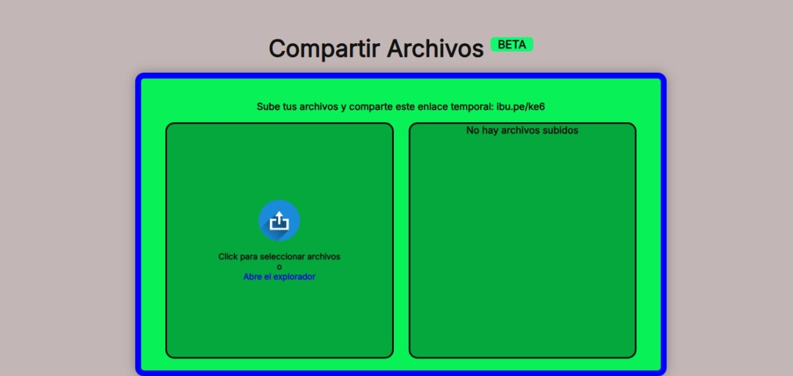

# 📁 Instafile - Sistema Seguro de Compartición de Archivos

## Screenshots

Un sistema para compartir archivos personales de forma temporal y segura, con enlaces únicos y cifrado.

## 🚀 Características Principales

- **Subida Segura**: 
  - Validación de tipos de archivo (PDF, DOCX, PNG, JPEG, etc.)
  - Cifrado AES-256 para archivos almacenados
  - Protección contra inyecciones de rutas (Directory Traversal)

- **Enlaces Temporales**: 
  - Generación automática de códigos de 3 caracteres (ej: `ibu.pe/abc`)
  - Archivos almacenados por 72 horas (personalizable)

- **Interfaz Intuitiva**:
  - Drag & Drop para subir archivos
  - Barra de progreso en tiempo real
  - Iconos según tipo de archivo
  - Diseño 100% responsive

- **Seguridad Avanzada**:
  - Tokens CSRF para todas las operaciones
  - Protección contra XSS y MITM
  - Validación MIME real de archivos
  - Bloqueo de acceso a directorios privados